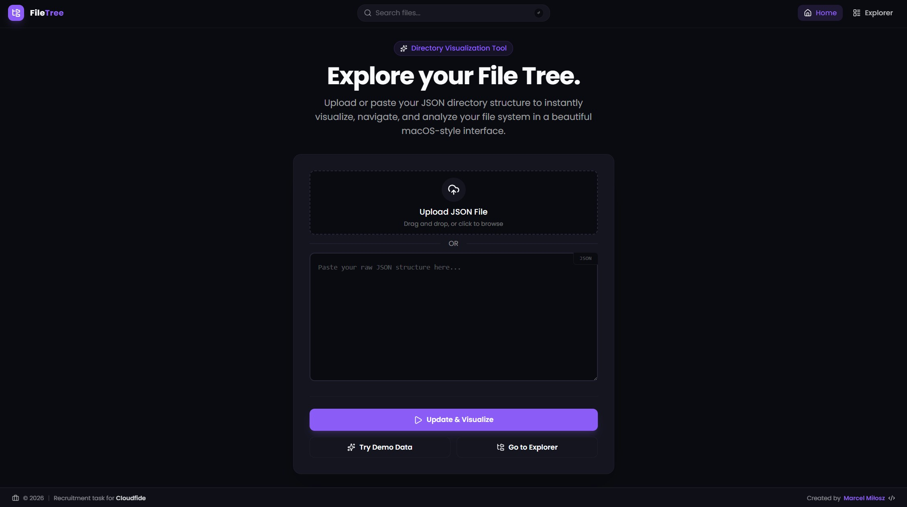

# FileTree Explorer

An interactive JSON directory visualizer built for developers. Upload or paste a JSON directory structure and instantly browse, search, and explore your file system in a clean, macOS-inspired interface.



Take a look on: https://marcel-milosz-task-cloudfide.vercel.app/

---

## Getting Started

Clone the repository, then run:

```bash
npm install
npm run dev
```

---

## Tech Stack

| Layer            | Choice                              |
| ---------------- | ----------------------------------- |
| Framework        | React 18+ (Vite)                    |
| Language         | TypeScript (Strict Mode)            |
| Routing          | React Router v6                     |
| State Management | Zustand with Persistence middleware |
| Styling          | Tailwind CSS                        |
| Icons            | Lucide React                        |

---

## Architecture

### State Management - Zustand + Persist

Zustand was chosen over React Context for its simpler API and better performance with global state. The `persist` middleware means the file tree survives page refreshes - users don't need to re-upload their JSON if they accidentally reload the tab.

### Hydration Pattern

Raw JSON has no concept of absolute paths. A `hydrateTree` utility recursively walks the input and injects a full path into every node (e.g. `root/src/index.ts`). This turns a nested structure into something URL-friendly, enabling deep links to any file or folder.

### Render-Phase Updates

Rather than using `useEffect` to sync navigation state (which can cause unnecessary re-renders), the app compares the previous and current URL path directly during render. This keeps updates atomic and instant, in line with React 18's concurrent rendering model.

### Centralized Configuration

To keep the codebase easy to maintain, two config files act as single sources of truth:

- **`paths.config.ts`** - all app routes live here, eliminating hardcoded strings and typos
- **`styles.config.ts`** - design tokens (border radii, animation durations, etc.) are defined once and shared everywhere

---

## Known Limitations

**Memory usage** - The entire JSON tree is parsed and hydrated in memory at once. This works fine for internal tooling, but very large trees (thousands of files) may slow down the main thread on initial load.

**Search performance** - Search currently walks the full tree on every query. For deeply nested structures, a pre-built index would be faster.

**Read-only** - The app doesn't support editing files or drag-and-drop reorganization, as these were out of scope for the initial version.

---

## Possible Future Improvements

- **Drag and drop** - File reordering via `dnd-kit`
- **Dark / light mode** - Theme toggle using Tailwind's class strategy
- **Web Worker hydration** - Move `hydrateTree` off the main thread so the UI stays responsive while loading large datasets

---

## Author

**Marcel Miłosz** - Built for the Cloudfide recruitment task.
